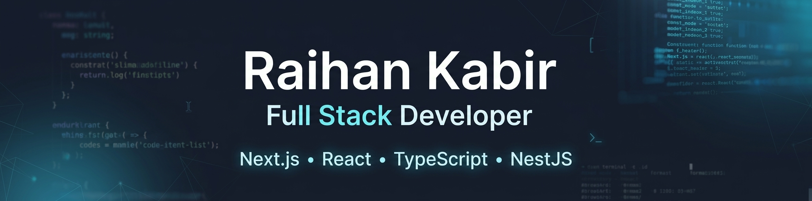

  

# Hi 👋, I'm Raihan

I'm a Full Stack Developer.
## 👨‍💻 About Me

I'm a Full Stack Developer focused on building modern, responsive, and scalable web applications.

I work mainly with React, Next.js, TypeScript, Node.js, NestJS, and PostgreSQL. I enjoy building real-world applications and learning new technologies to improve my development skills.

## 🚀 Current Activities

- 🔭 Currently working on **CodeSphere**, a full-stack developer community platform.
- 🌱 Currently learning and improving my skills in **Next.js, NestJS, Prisma, PostgreSQL, and WebSockets**.
- 💻 Building real-world full-stack applications to strengthen my development skills.

## 🔗 Connect With Me

  
  
  

## 🛠️ TECHNOLOGY STACK

### 💻 Languages

  
  
  
  
  
  
  

### 🎨 Frontend

  
  
  
  
  

### ⚙️ Backend & Frameworks

  
  
  
  
  

### 🗄️ Database

  
  
  
  

### 🔧 Tools & Technologies

  

## 📊 GitHub Stats

  
  

